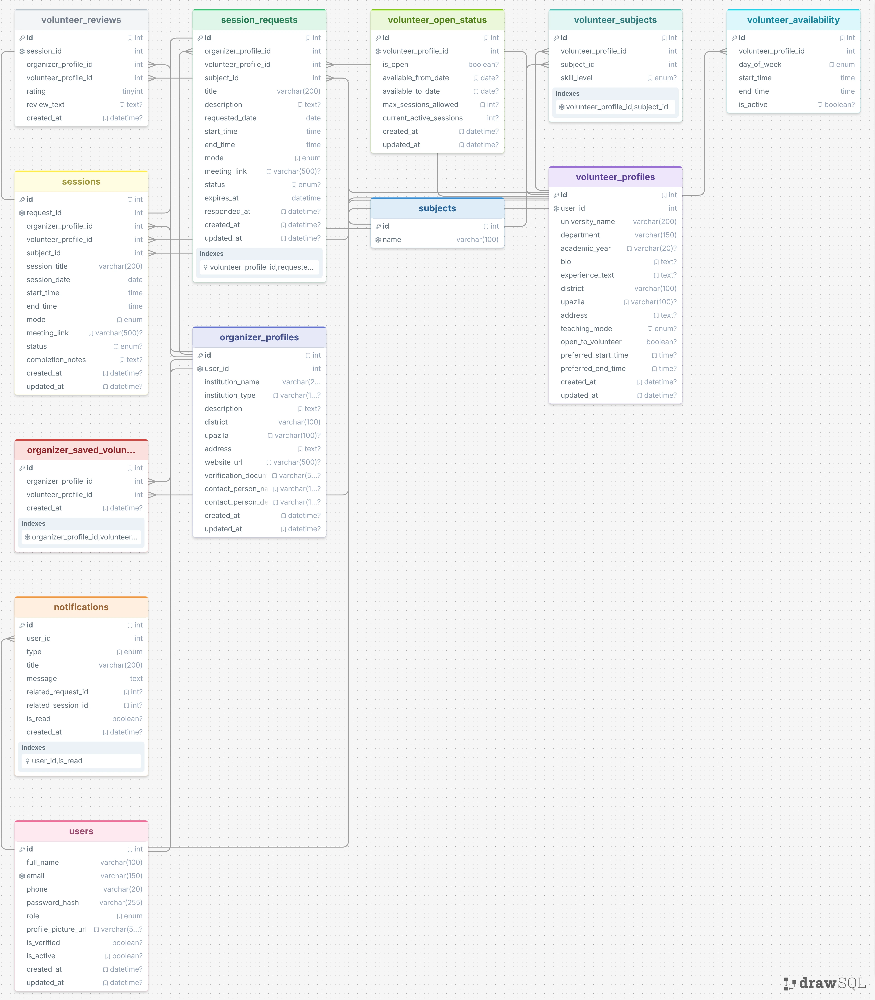

#SHIKKHASETU-Backend


Backend API for connecting university student volunteers with rural educational institutions in Bangladesh.

---

## Stack

- Node.js
- Express.js
- MySQL
- JWT Authentication

## Run

```bash
npm install
npm run dev
```
---


## SHIKKHASETU WEB TECH PROJECT DATABSE SCHEMA

<p align="center">
  
</p>

---

